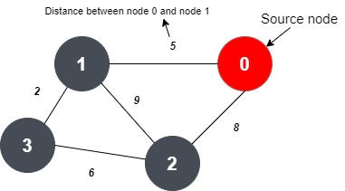

# Truck-routing--dijkstra

Dijkstra algorithm selects a reference node and find the shortest path of every other node from that reference. If I see truck at point 0; this algorithm will tell me the shortest path among 0-1, 0-2 and 0-3.   
<h3>Data strucutres required- Graph theory, array, list</h3>    

